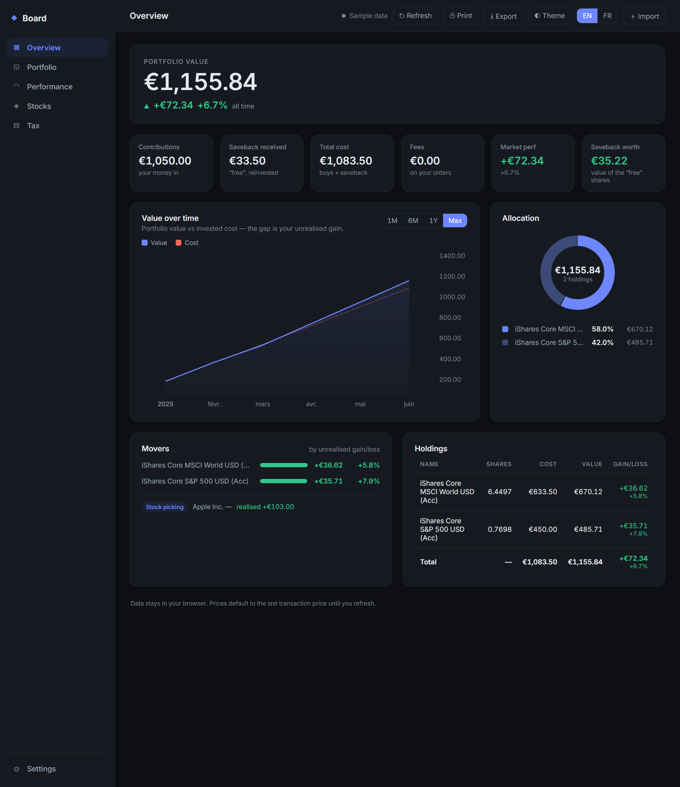
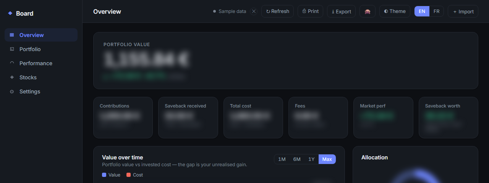
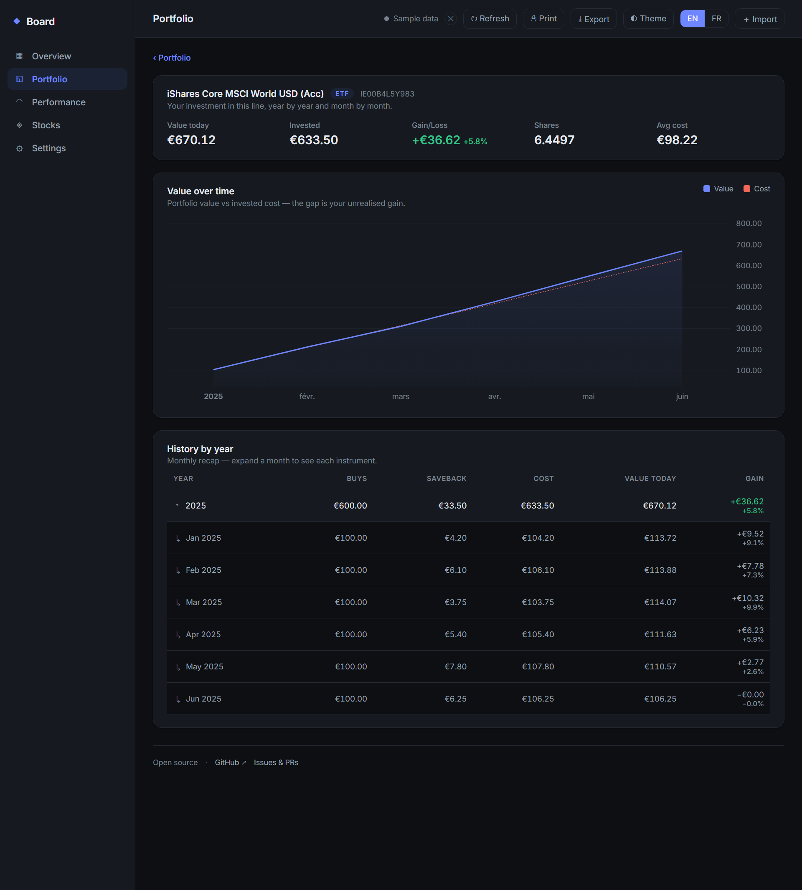
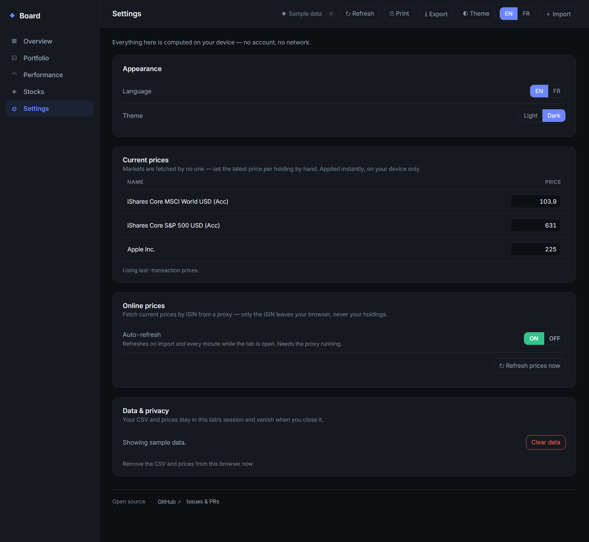

# TradeRepublicBoard

Turn a **Trade Republic** CSV export into a private **portfolio dashboard** —
dollar-cost averaging (DCA), savebacks, single-stock picking, per-asset
drilldowns, a French tax summary, and a month-by-month *mark-to-market* history.

Runs **100 % in your browser** — nothing is uploaded, no account, no server.
A companion **command-line tool** builds the same view as a polished Excel
workbook. **English or French · light / dark.**

> **Unofficial project.** Not affiliated with, endorsed by, or connected to
> Trade Republic. It only reads a CSV you export yourself. Personal tracking
> tool, **not** investment or tax advice.



---

## Web dashboard — run it with Docker

The main app is a **fully local** SvelteKit dashboard. It reads your Trade
Republic CSV **in your browser**; the data never leaves your device. One command
brings it up (a small, **non-root** nginx serves a static build — no Node needed):

```bash
docker compose up --build
# then open http://localhost:8080
```

That starts the app and, optionally, the price proxy (see *Online prices* below).
For development instead: `cd packages/web && npm install && npm run dev` (Node 22+).

### What you get

- **Overview** — portfolio value, KPIs (contributions, saveback, fees, market
  performance, saveback worth), a value-vs-cost chart, an allocation donut,
  movers and a holdings table.
- **Click any holding → its own page** — a value-over-time chart for *that* line
  and its investment history, year by year and month by month.
- **Per-year monthly recap** with **expandable rows**: open a month to see each
  instrument (amounts and gains), the total kept end-of-line.
- **Issuer & ISIN** — each ETF shows its issuer (iShares, Amundi, Vanguard,
  Xtrackers…), parsed offline from its name; the ISIN links out to justETF for
  more detail.
- **Print / Save as PDF** and **Export `.xlsx`** — the workbook mirrors the CLI
  (styling and charts included), built entirely in-browser with **no dependency
  and no network**.
- **Prices your way** — type current prices by hand in **Settings**, or fetch
  them online (opt-in, see below). Gains are green, losses red, everywhere.
- **Privacy blur** — hit 👁 or press `H` to blur every figure at once (a
  colleague walks by); never leaks into a print.
- **Responsive sidebar** — collapses to an icon-only rail below ~980px, so
  navigation still works with two windows side by side.



| Per-asset drilldown | Settings (prices, privacy) |
|---|---|
|  |  |

### Online prices (opt-in — the only networked feature)

A tiny [price proxy](packages/price-proxy) fetches current prices **by ISIN**
(Deutsche Börse / Xetra, Yahoo fallback) — **only the ISIN ever leaves your
browser, never your holdings**. It runs as a local Node server (`docker compose
up` starts it alongside the app) or a Cloudflare Worker. It's **off by default**:
flip **Settings → Online prices → Auto-refresh** to **ON** (refreshes on import
and every minute), or hit **Refresh** for a one-shot. The strict CSP limits
`connect-src` to that proxy and nothing else. The proxy address is baked into the
build (`PROXY_URL` in `packages/web/src/lib/state.ts`, `http://localhost:8787` by
default).

---

## Command-line tool — Excel workbook

Prefer a file you can keep? `tr_board.py` turns the same CSV into a styled,
self-contained **Excel workbook** (Dashboard, By-ETF with charts, Yearly, Tax,
Stock Picking, Read me). Its only runtime dependency is
[`openpyxl`](https://pypi.org/project/openpyxl/); needs **Python 3.9+**.

```bash
python -m pip install -r requirements.txt
python tr_board.py --fi transactions.csv --fo board.xlsx --en   # or --fr
```

Re-run it every month on a fresh export: the journal is rebuilt and your prices
are **preserved by ISIN**. Add `--auto-prices` to fetch quotes by ISIN, or
`--watch DIR` for a one-shot the OS scheduler can call (it processes an export
dropped in `DIR` and deletes it on success).

| Option | What it does | Default |
|---|---|---|
| `--fi` / `--fo` | Input CSV / output workbook | `transactions.csv` / `TradeRepublicBoard.xlsx` |
| `--en` / `--fr` | Workbook language | `--en` |
| `--auto-prices` | Fetch current prices by ISIN (needs internet) | off |

Try it on the bundled fake data:

```bash
python tr_board.py --fi sample_data/transactions_sample.csv --fo demo.xlsx --en
```


---

## Deploy to Cloudflare (optional)

The dashboard is a **static site** and the proxy is already a **Worker**. You get
a shareable URL and anyone can import *their own* CSV — their data stays in their
browser. All you need is a free Cloudflare account.

**Prerequisite: Node 22+.** `wrangler` refuses to run on anything older. If
`node -v` shows < 22 (common with Ubuntu/WSL's default `apt` package, which is
stuck on Node 18), install a current one — no `sudo` needed:

```bash
curl -o- https://raw.githubusercontent.com/nvm-sh/nvm/v0.40.1/install.sh | bash
source ~/.bashrc          # reload the shell so `nvm` is available
nvm install 22 && nvm use 22
node -v                   # should print v22.x
```

**1 — Log in and deploy the price proxy (Worker):**

```bash
cd packages/price-proxy
npx wrangler login        # opens a browser tab to authorise the CLI
npx wrangler deploy
# → https://traderepublic-price-proxy.<your-subdomain>.workers.dev
```

Note the URL — you'll need it in the next step. First deploy on a fresh account
creates the Workers project automatically.

**2 — Point the app at the Worker.** Set that URL in two places —
`PROXY_URL` in `packages/web/src/lib/state.ts`:

```js
const PROXY_URL = "https://traderepublic-price-proxy.<your-subdomain>.workers.dev";
```

— and `connect-src` in `packages/web/svelte.config.js` (keep `localhost:8787`
too, so local Docker/dev still works from the same build):

```js
"connect-src": ["self", "http://localhost:8787", "https://traderepublic-price-proxy.<your-subdomain>.workers.dev"],
```

**3 — Build and publish the app (Pages, direct upload):**

```bash
cd packages/web
npm install && npm run build
npx wrangler pages deploy build --project-name traderepublicboard
# → https://traderepublicboard.pages.dev
```

First deploy creates the Pages project and asks for a production branch name —
the defaults are fine. Open the Pages URL — online prices are **off by
default**; turn on **Settings → Online prices** to use the Worker. The bundled
`static/_redirects` handles client-side routes.

**Redeploying later:** re-run the relevant command above (`wrangler deploy` for
the proxy, `npm run build && wrangler pages deploy build --project-name
traderepublicboard` for the app) — or let the bundled workflows do it (next).

**4 — (optional) Auto-deploy on push.** The repo ships two GitHub Actions
workflows — [`deploy-web.yml`](.github/workflows/deploy-web.yml) and
[`deploy-worker.yml`](.github/workflows/deploy-worker.yml) — that redeploy on
every push to `main` (the app when `packages/web`/`packages/core` change, the
Worker when `packages/price-proxy` changes). They use the same **direct upload**
as above, so Cloudflare still never gets access to your repository. To enable
them, add two repository secrets in **Settings → Secrets and variables →
Actions**:

- `CLOUDFLARE_ACCOUNT_ID` — from **Workers & Pages → Overview** (right sidebar).
- `CLOUDFLARE_API_TOKEN` — **My Profile → API Tokens → Create Token → Create
  Custom Token** with just two account permissions: **Cloudflare Pages: Edit**
  and **Workers Scripts: Edit**. Nothing else — least privilege.

Until both secrets exist the workflows simply fail (harmless); once set, a push
to `main` redeploys within a minute. You can also run either from the **Actions**
tab (**Run workflow**).

> ⚠️ **Never run `npm audit fix --force` in `packages/web`.** SvelteKit's
> dependency graph includes a low-severity, dev-only advisory (a `cookie` edge
> case, irrelevant to this static-adapter app and excluded from the CI gate,
> which only checks shipped/production dependencies). `--force` "fixes" it by
> downgrading `@sveltejs/kit` to a pre-1.0 alpha from 2020, which breaks the
> build entirely. If `npm install` ever reports vulnerabilities, ignore the
> suggestion or open an issue — don't `--force` it.

> **Why Actions and not the Pages Git integration.** Both give auto-deploy on
> `git push`. The bundled workflows keep **direct upload** — the API token lives
> in *your* repo secrets and Cloudflare never gets access to your code. The
> dashboard's Git integration instead installs the **Cloudflare GitHub App**; if
> you go that route, scope it to **this repository only**, not "all repositories",
> so it can't read your other private repos. (Logging into Cloudflare *with*
> GitHub is just SSO — basic profile; repo access is a separate, per-repo grant.)

---

## Privacy & security

Security and privacy are first-class goals here — see **[SECURITY.md](SECURITY.md)**.

- Everything runs **on your machine**. Your CSV is read in the browser (or by the
  CLI locally) and **never leaves your device**.
- The **only** outbound request is the opt-in price refresh, which sends a single
  **ISIN** (a public identifier) to the proxy — never your holdings or amounts.
  The proxy keeps no state and logs nothing.
- **No CDN, no analytics, no telemetry.** Fonts are self-hosted; a **strict CSP**
  (`default-src 'self'`) limits `connect-src` to the price proxy alone.
- **OWASP-aware**: the CSV is treated as **untrusted input** (size cap, UTF-8
  check, required-column check, row/field caps, and **spreadsheet
  formula-injection** neutralisation of `= + - @`); **no useless data is
  retained** — processed in memory, discarded after use.
- **Test-gated (TDD)**: the Python and TypeScript cores must produce an identical
  model on shared golden [`fixtures/`](fixtures) (CI), so the two can never drift.

---

## How it works

- **ETF portfolio** = transactions with `asset_class = FUND`. **Single stocks** =
  other `TRADING` transactions, routed to their own view.
- **Savebacks** — a `BENEFITS_SAVEBACK` credit reinvested by a buy of the same
  amount is tagged as a *Saveback* (the "free" shares).
- **Realised gains** use the **weighted-average cost** method.
- **Portfolio value over time** is *indicative*: it prices each month at *its own
  transactions* (the only prices in the export); the last point uses the current
  price. Instrument names come straight from the CSV — nothing to maintain.
- **Price sources** (`--auto-prices` / the proxy), by ISIN, with a silent
  fallback: **Deutsche Börse / Xetra** first (EUR reference venue), then
  **Yahoo Finance**.

The portfolio logic is a small, pure data layer with a language-neutral model
contract ([`docs/MODEL.md`](docs/MODEL.md)); `tr_board.py --emit-model --fi <csv>`
prints it as JSON.

```bash
pip install openpyxl pytest && python -m pytest -q
```

Contributions welcome — see **[CONTRIBUTING.md](CONTRIBUTING.md)**. CI gates every
PR on correctness (Python + TS parity, web build), security (gitleaks, `npm audit`,
`pip-audit`, CodeQL), and keeps dependencies current with Dependabot.

## Credits

Time-series charts use
[TradingView Lightweight Charts™](https://www.tradingview.com/lightweight-charts/)
(Apache-2.0). The UI is set in [Inter](https://rsms.me/inter/) by Rasmus
Andersson, self-hosted (latin subset, no CDN) under the
[SIL Open Font License 1.1](packages/web/static/fonts/Inter-OFL.txt).

## License

[MIT](LICENSE) © LGD-P
