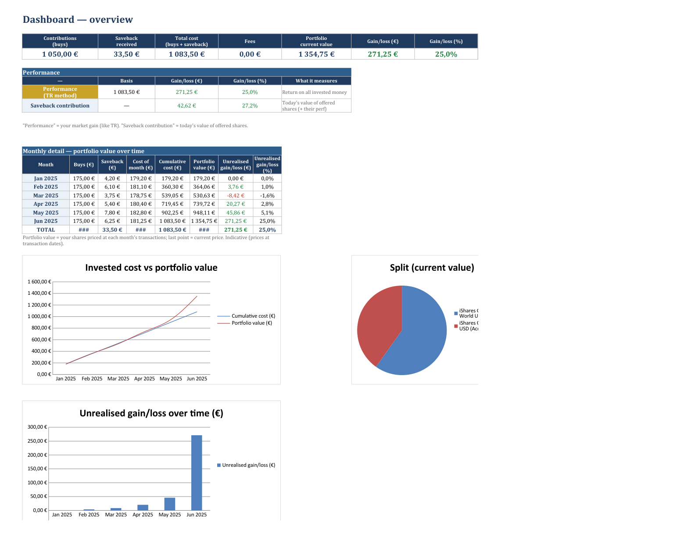
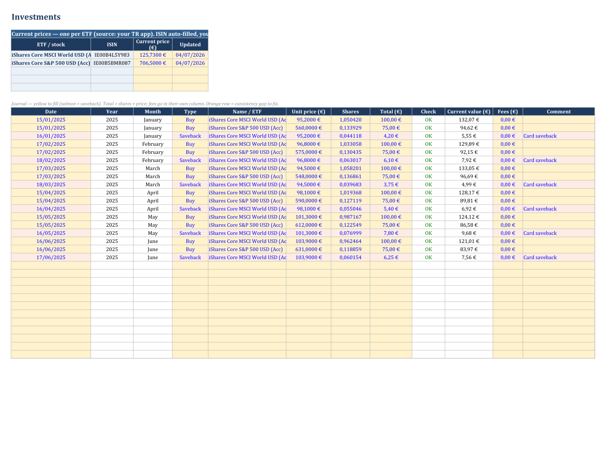
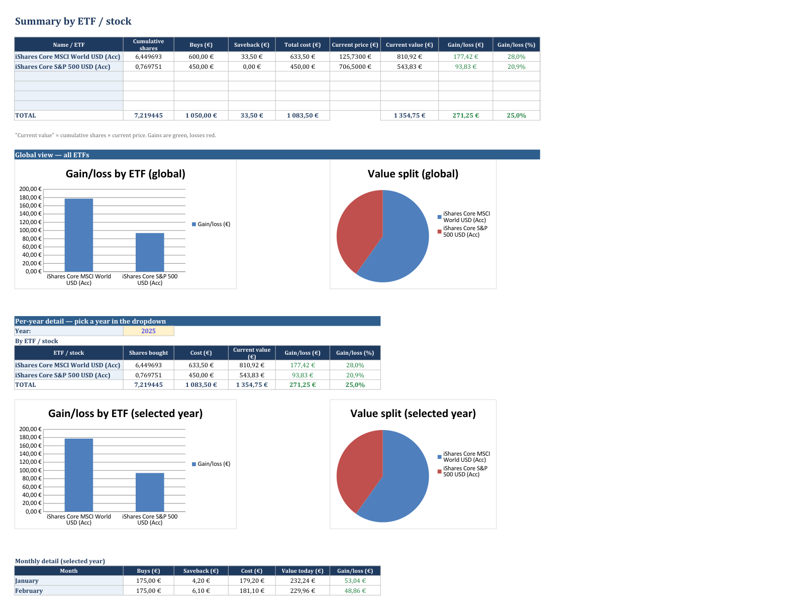

# TradeRepublicBoard

Turn a **Trade Republic** CSV export into a polished, self-contained **Excel
portfolio board** — dollar-cost averaging (DCA), savebacks, single-stock picking,
a tax summary, and a month-by-month *mark-to-market* history of your portfolio.

One command in, one clean workbook out. Available in **English** or **French**.

> **Unofficial project.** Not affiliated with, endorsed by, or connected to
> Trade Republic. It only reads a CSV you export yourself. Personal tracking
> tool, **not** investment or tax advice.



---

## Highlights

- **Rebuilt from scratch every run** — no template file to carry around, share the
  single script.
- **Understands savebacks** — a `BENEFITS_SAVEBACK` credit reinvested by a buy of
  the same amount is tagged as a *Saveback* (salmon rows).
- **Stock picking with realised P/L** — single stocks get their own sheet with
  **weighted-average cost** and realised gains.
- **Mark-to-market history** — the Dashboard traces your portfolio value over time,
  each month priced at *its own transactions* (the real TR execution prices); the
  last point uses the current market price.
- **Tax sheet** — cash interest and realised gains per year, for your filing.
- **Green gains / red losses** everywhere, interactive per-year drilldown, charts.
- **Optional auto prices** by ISIN (Deutsche Börse / Xetra, Yahoo fallback) — or
  just type them in the yellow cells.
- **Your prices are preserved** across monthly refreshes (keyed by ISIN).
- **Bilingual output** — `--en` (default) or `--fr`.

| Investments journal | By ETF (interactive) |
|---|---|
|  |  |

---

## Install

The only runtime dependency is [`openpyxl`](https://pypi.org/project/openpyxl/).
Requires **Python 3.9+**.

### With pip

```bash
git clone https://github.com/LGD-P/TradeRepublicBoard.git
cd TradeRepublicBoard
python -m pip install -r requirements.txt
python tr_board.py --fi transactions.csv --fo board.xlsx --en
```

### With Poetry

```bash
git clone https://github.com/LGD-P/TradeRepublicBoard.git
cd TradeRepublicBoard
poetry install
poetry run tr-board --fi transactions.csv --fo board.xlsx --en
```

---

## Usage

1. In the Trade Republic app, export your transactions as CSV.
2. Run the script:

   ```bash
   python tr_board.py --fi transactions.csv --fo board.xlsx
   ```

3. Open the workbook and fill the **Current price** (yellow) cells — or let the
   script fetch them:

   ```bash
   python tr_board.py --fi transactions.csv --fo board.xlsx --auto-prices
   ```

Re-run it every month on a fresh export: the journal is rebuilt and your prices
are preserved.

### Options

| Option | What it does | Default |
|---|---|---|
| `--fi` | Input CSV (Trade Republic export) | `transactions.csv` |
| `--fo` | Output workbook | `TradeRepublicBoard.xlsx` |
| `--en` / `--fr` | Workbook language | `--en` |
| `--auto-prices` | Fetch current prices by ISIN (needs internet) | off |

Try it right now on the bundled fake data:

```bash
python tr_board.py --fi sample_data/transactions_sample.csv --fo demo.xlsx --en
```

### Automate it (optional watcher)

`--watch DIR` is a one-shot: if `DIR` contains the export file it processes it and
**deletes it on success**, otherwise it exits quietly. Point your OS scheduler at it.

```bash
python tr_board.py --watch inbox --fo out/board.xlsx --auto-prices
```

- **Linux (cron, hourly):**
  `0 * * * * cd /path/to/repo && python3 tr_board.py --watch inbox --fo out/board.xlsx --auto-prices`
- **Windows (Task Scheduler):** register an hourly task running
  `python C:\path\to\repo\tr_board.py --watch inbox --fo out\board.xlsx --auto-prices`

The expected filename is `trade-republic-export.csv` (override with `--watch-name`).

---

## The sheets

| Sheet | Content |
|---|---|
| **Dashboard** | KPIs, performance, portfolio value over time, charts. |
| **Investments** | Live prices (ISIN auto-filled) + the ETF journal (Buy / Saveback / Sell). |
| **By ETF** | Performance per line, global charts, and an interactive **per-year** drilldown (dropdown) with charts. |
| **Yearly** | Contributions and gains per year. |
| **Tax** | Cash interest and realised gains per year, for your filing. |
| **Stock Picking-IPO** | Single stocks: transactions, weighted-average cost, realised & unrealised P/L. |
| **Read me** | A short in-workbook guide. |

---

## How it works

- **ETF portfolio** = transactions with `asset_class = FUND`. **Single stocks** =
  other `TRADING` transactions, routed to the stock sheet.
- **Ignored**: card payments, transfers and marketing. **Cash interest** is kept on
  the Tax sheet only (it is taxable).
- **Instrument names** come straight from the CSV (`symbol` = ISIN, `name` = label)
  — nothing to maintain; a new ETF or stock shows up on its own.
- **Realised gains** use the **weighted-average cost** method.
- **Portfolio value over time** is *indicative*: it uses transaction-date prices
  (the only prices present in the export), not end-of-month quotes.

### Price sources (`--auto-prices`)

Queried by ISIN, in order, with a silent fallback (a missing price just stays
empty, to fill by hand):

1. **Deutsche Börse / Xetra** — European reference venue, EUR quotes, closest to
   Trade Republic;
2. **Yahoo Finance** — international fallback if the ISIN is not listed on Xetra.

---

## Privacy

- The tool runs **entirely on your machine**. Your CSV never leaves it.
- The only outbound requests happen with `--auto-prices`, and only send an **ISIN**
  (a public identifier) to the price sources above — never your holdings or amounts.
- No CDN, no analytics, no telemetry.
- The CSV is treated as **untrusted input**: size cap, UTF-8 check, required-column
  check, row/field caps, and **spreadsheet formula-injection** neutralisation
  (`= + - @`) before anything is written to the workbook.

---

## Roadmap

- ✅ directory watcher that ingests a new export and deletes it once processed
  (`--watch`);
- ✅ hardened, validated CSV ingestion (formula-injection safe);
- Dockerisation;
- a proper web dashboard (with monthly / yearly PDF & CSV export);
- a TDD test suite and CI (`tests/` already started).

---

## License

[MIT](LICENSE) © LGD-P
